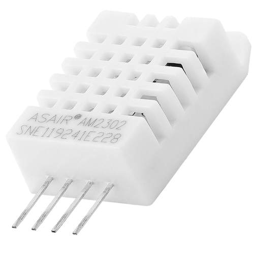
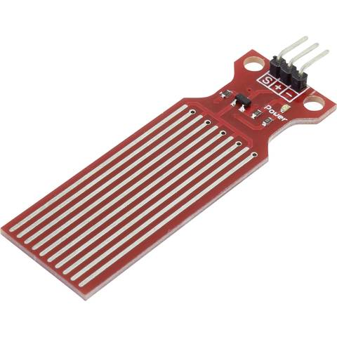
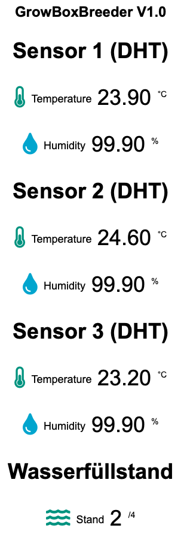

# GrowBox Breeder 
Da man einige Pflanzen / Kräuter keimen und sprießen lassen muss, habe ich mir eine Anzuchtstation zugelegt. Meine Anzuchtstation ist zwar temperiert, allerdings kann ich diese nicht regeln.

Um zu überprüfen, ob die Idealbedingungen erfüllt sind, habe ich den GrowBox Breeder konzipiert.
Solltet ihr Fragen oder Anregungen haben, öffnet bitte ein Issue!

Viel Spaß beim Nachbauen!

## Benötigte Hardware

- Wemos D1 Mini
- 2 x DHT22
- Wassersensor

## Anschluss Plan

### Pin Out Arduino Mega 2560 REV3

D1 Mini | Sensor
-------- | --------
A0   | Wassersensor
D1   | DHT22
D2  | DHT22
D3  | DHT22

### DHT22

DHT22 | Mega
-------- | --------
VCC   | 5V
GND   | GND
0   | 0
DATA   | D1,D2,D3

### Feuchtesensor SE045

Soil Sensor | Mega
-------- | --------
S   | A0
+   | 5V
-  | GND

### Weboberfläche

## Hinweise

Die Software wurde mit Platform.io geschrieben. Der Code kann aber aus dem Ordner `src` in die Arduino IDE übernommen werden.
Allerdings muss man dann noch die Bibliotheken manuell hinzufügen!
